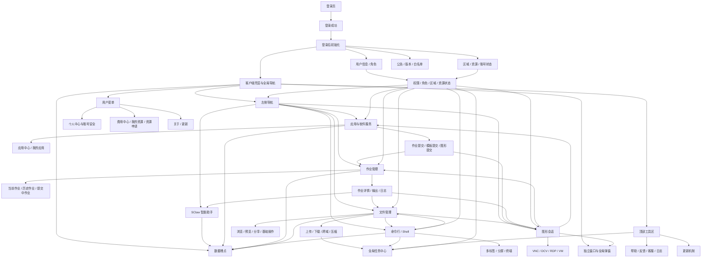

# 客户端功能关系图谱

## 1. 全局模块关系图

## 2. 用户主路径图

### 路径 1：登录并进入客户端

| 项 | 内容 |
|---|---|
| 触发入口 | 登录页 `/` |
| 用户动作 | 输入账号密码或验证码，勾选记住密码/自动登录，提交登录 |
| 系统反馈 | 登录成功后进入主框架，加载用户信息、区域资源、公告、版本、白名单 |
| 关联模块 | 登录、初始化、壳层、权限、公告、更新、SClaw |
| 可能中断点 | 验证码错误、账号密码错误、登录过期、自动登录失败、弱密码提醒 |
| 异常提示 | 登录失败原因、登录过期重新登录、弱密码设置提示 |
| 后续去向 | 应用、作业、文件、Shell、图形、SClaw |

### 路径 2：申请/配置资源后使用客户端

| 项 | 内容 |
|---|---|
| 触发入口 | 文件、当前作业、应用提交、图形创建等资源依赖页面 |
| 用户动作 | 进入页面或提交前选择资源 |
| 系统反馈 | 有资源时进入业务；缺资源时弹出“开通计算资源”或应用内资源不足提示 |
| 关联模块 | 资源申请、权限、应用、作业、文件、图形 |
| 可能中断点 | 无区域资源、资源配置中、申请待审批、区域维护、账号停用 |
| 异常提示 | 预计 1-5 分钟、已提交资源申请、联系团队管理员、区域维护 |
| 后续去向 | 查看订单、购买资源、按区域购买、刷新资源、继续业务 |

### 路径 3：从应用提交计算作业

| 项 | 内容 |
|---|---|
| 触发入口 | 应用中心、我的应用、应用卡片、模板提交页 |
| 用户动作 | 选择应用和版本，填写参数，选择资源、队列、文件路径，提交 |
| 系统反馈 | 提交成功进入作业管理；提交失败显示异常说明 |
| 关联模块 | 应用、作业、文件、资源、权限、SClaw |
| 可能中断点 | 软件未购买、应用到期、无资源、账号停用、区域维护、参数校验失败 |
| 异常提示 | 无资源引导、软件未开通、提交失败、SSH/RDP 异常、存储不足 |
| 后续去向 | 当前作业、提交中作业、作业详情、文件输出、AI 日志分析 |

### 路径 4：查看和管理作业

| 项 | 内容 |
|---|---|
| 触发入口 | 左侧作业菜单、应用提交成功跳转 |
| 用户动作 | 查看当前/历史/提交中作业，筛选，进入详情，操作作业 |
| 系统反馈 | 列表、详情、日志、文件、输出和操作结果更新 |
| 关联模块 | 作业、文件、图形、SClaw、资源 |
| 可能中断点 | 区域维护、账号停用、作业状态不允许操作、外部链接权限不足 |
| 异常提示 | 操作原因弹窗、取消/挂起/释放提示、作业异常信息 |
| 后续去向 | 输出日志、工作目录、图形会话、AI 分析、重新提交 |

### 路径 5：打开图形会话

| 项 | 内容 |
|---|---|
| 触发入口 | 图形会话页、图形应用中心、应用图形提交、作业详情 |
| 用户动作 | 选择图形应用或会话类型，填写参数，创建或打开会话 |
| 系统反馈 | 创建中、排队中、运行中、连接中，最终打开 VNC/DCV/RDP/VM 窗口 |
| 关联模块 | 图形、应用、作业、资源、壳层 |
| 可能中断点 | 区域维护、账号停用、会话数量超限、存储不足、远程连接未就绪 |
| 异常提示 | 创建失败、资源不足、作业未运行、VM 初始化中 |
| 后续去向 | 远程桌面、会话列表、作业日志、会话续期或删除 |

### 路径 6：使用命令行访问集群

| 项 | 内容 |
|---|---|
| 触发入口 | 左侧命令行入口、文件右键 Shell 打开、应用中心 Shell |
| 用户动作 | 选择区域/集群/节点，打开终端，多标签或分屏操作 |
| 系统反馈 | 连接集群终端，显示软件信息和文件侧栏 |
| 关联模块 | Shell、文件、资源、任务中心 |
| 可能中断点 | BGP 角色隐藏、区域维护、账号停用、登录节点异常、WebSocket 连接失败 |
| 异常提示 | 服务异常、连接失败、账号异常、错误检查提示 |
| 后续去向 | 文件上传下载、路径联动、软件环境、作业命令执行 |

### 路径 7：管理文件、上传下载和跨域传输

| 项 | 内容 |
|---|---|
| 触发入口 | 左侧文件入口、Shell 文件面板、应用/作业文件选择器 |
| 用户动作 | 浏览目录、上传、下载、分享、压缩、跨域、右键 Shell 打开 |
| 系统反馈 | 文件列表刷新，任务进入上传/下载/跨域/压缩列表 |
| 关联模块 | 文件、任务中心、Shell、作业、图形、资源 |
| 可能中断点 | 区域维护、账号停用、权限不足、存储不足、快传工具缺失 |
| 异常提示 | 上传失败、下载失败、权限不足、跨域错误码、压缩提交失败 |
| 后续去向 | 全局任务中心、下载目录、Shell、作业提交、图形后处理 |

### 路径 8：使用 SClaw 完成智能辅助

| 项 | 内容 |
|---|---|
| 触发入口 | 左侧 SClaw 入口、作业日志 AI 分析入口 |
| 用户动作 | 新建对话、选择技能、发送消息、配置频道/定时任务/模型 |
| 系统反馈 | 返回回答、工具状态、思考过程、技能执行结果 |
| 关联模块 | SClaw、作业、登录、权限、数据埋点 |
| 可能中断点 | 白名单不通过、Gateway 服务异常、模型配置缺失、额度不足 |
| 异常提示 | 服务启动失败、模型错误、配额链接、错误条 |
| 后续去向 | 继续对话、技能安装、频道配置、定时任务 |

### 路径 9：作业失败后使用 AI 分析日志

| 项 | 内容 |
|---|---|
| 触发入口 | 作业详情、作业输出、日志选中文本 |
| 用户动作 | 查看 stdout/stderr 或运行日志，点击 AI 分析或选中文本辅助 |
| 系统反馈 | SClaw 打开并接收日志上下文，生成分析建议 |
| 关联模块 | 作业、SClaw、文件、日志 |
| 可能中断点 | SClaw 不可用、白名单未通过、日志为空、作业状态未产生日志 |
| 异常提示 | 无日志、AI 服务不可用、额度不足 |
| 后续去向 | 修改应用参数、重新提交、打开文件目录、联系支持 |

### 路径 10：客户端更新和问题反馈

| 项 | 内容 |
|---|---|
| 触发入口 | 顶部更新提示、关于弹窗、帮助/反馈/客服菜单 |
| 用户动作 | 查看版本、立即升级、打开帮助、提交反馈、在线咨询、打开日志 |
| 系统反馈 | 弱更新提示、强更新弹窗、客服窗口、日志目录 |
| 关联模块 | 更新、帮助客服、日志、壳层 |
| 可能中断点 | 更新下载失败、客服加载失败、日志目录打开失败 |
| 异常提示 | 强更新阻断、无效更新站点、客服连接异常、日志记录 |
| 后续去向 | 安装更新、提交反馈、发送日志给客服 |

## 3. 功能依赖关系

| 功能 | 依赖对象 | 依赖类型 | 影响说明 |
|---|---|---|---|
| 登录后主框架 | 登录态 | 登录态依赖 | 登录成功后才进入主框架 |
| 左侧导航 | 用户角色、白名单、资源状态 | 权限依赖 | 决定 SClaw、Shell、任务等入口可见性 |
| SClaw | 白名单、Gateway、模型配置 | SClaw 白名单依赖 / 后端服务依赖 | 入口、对话、技能、频道受控 |
| 应用提交 | 应用购买、资源、区域、账号、文件 | 应用购买依赖 / 资源依赖 | 任一前置异常会阻断提交 |
| 作业管理 | 区域、账号、作业服务 | 资源依赖 / 后端服务依赖 | 影响列表、操作、详情和日志 |
| Shell | 区域、账号、网络、节点 | 资源依赖 / 网络依赖 | 影响终端连接和文件面板 |
| 图形会话 | 应用交付、资源、会话数量、远程桌面服务 | 资源依赖 / 本地客户端依赖 | 影响 VNC/DCV/RDP/VM 创建和打开 |
| 文件管理 | 区域、账号、文件权限、存储配额 | 资源依赖 / 权限依赖 | 影响浏览、上传、下载、分享、压缩 |
| 跨域传输 | 多区域资源、源/目标账号、文件权限 | 资源依赖 / 权限依赖 | 影响任务创建和恢复 |
| 压缩/解压 | 文件权限、作业服务、存储空间 | 后端服务依赖 / 资源依赖 | 通过作业执行并回写文件结果 |
| 全局任务中心 | 本地客户端、文件任务、作业任务 | 本地客户端依赖 | 影响任务进度、关闭保护和本地下载位置 |
| 费用/我的资源 | 控制台地址、角色 | 后端服务依赖 / 权限依赖 | 管理员与成员进入不同流程 |
| 更新机制 | 版本接口、Electron updater、下载地址 | 网络依赖 / 本地客户端依赖 | 影响强弱更新提示和安装 |
| 帮助/反馈/客服 | 外部文档、控制台、客服服务 | 网络依赖 / 后端服务依赖 | 影响问题闭环 |
| 数据埋点 | 神策、百度统计、用户状态 | 后端服务依赖 | 影响产品分析，不阻断用户主流程 |
